# STG Template Meowa

A small but complete grid tactics game template built in Godot 4.6, with the game art, UI art, music, and sound effects produced through Meowa.

This repository is meant to show how Meowa can be used to build a playable strategy tactics game from generated assets. It can also be used as a starting point for turn-based grid combat games with isometric boards, telegraphed enemy attacks, displacement skills, and between-mission upgrades.

[English](#english) | [中文](#中文)

<p align="center">
  
</p>

<p align="center">
  
</p>

<p align="center">
  
</p>

## English

### What this is

This is a compact tactical strategy template:

1. Defend buildings on an 8x8 isometric battlefield.
2. Control a fixed squad of three mechs.
3. Read enemy telegraphs before they attack.
4. Push, pull, block, and redirect enemies to protect the grid.
5. Clear seven missions, buying upgrades between battles.

The project is intentionally small enough to study, but complete enough to use as a real template: it has deterministic combat logic, view-layer animation, generated pixel assets, audio, tests, and Web export tooling.

### Game systems

- 8x8 isometric tactical board.
- Three playable mech roles: melee, artillery, and science/control.
- Enemy attack telegraphs resolved on the following enemy phase.
- Push and pull mechanics with water, chasm, mountain, building, unit, and map-edge collision rules.
- Attack preview computed from a cloned battle state.
- Undo support from a turn-start snapshot.
- Seven-mission run structure with a shop between missions.
- Grid power carryover across missions.
- Godot Web export with a fixed-size pixel canvas shell.

### Built with Meowa

The project uses generated assets as first-class production files, not placeholders.

| Asset area | In this repo | Meowa workflow |
| --- | --- | --- |
| Mech and enemy sprites | `assets/sprites/` | Pixel sprite generation |
| Terrain and buildings | `assets/tiles/` | Isometric tile generation |
| HUD panels and icons | `assets/ui/generated_hud_pixel_meowa/` | Pixel UI generation and slicing |
| Title art | `assets/ui/title_bg.png` | Image generation |
| Music and sound effects | `assets/audio/` | Music and SFX generation |

### Character sprites and animations

The README GIFs are prebuilt 2x nearest-neighbor exports from the in-game 64x64 unit sprites, so GitHub can show them directly without non-integer display scaling.

| Unit | Static sprite | Idle | Attack | Hit |
| --- | --- | --- | --- | --- |
| Prime Mech |  | 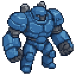 |  | 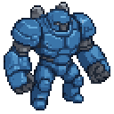 |
| Artillery Mech |  | 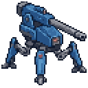 | 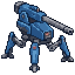 |  |
| Science Mech |  | 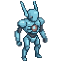 |  | 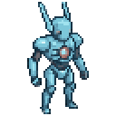 |
| Hornet |  | 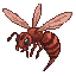 |  |  |
| Firefly |  |  | 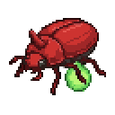 |  |
| Scorpion |  |  | 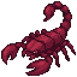 | 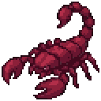 |
| Scarab |  |  |  | 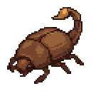 |
| Hornet Leader |  | 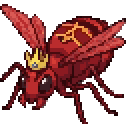 |  |  |

To regenerate assets, set a Meowa API key locally:

```bash
echo 'MEOWART_API_KEY=<your-key>' > .env
python3 .agents/skills/game-assets/meowart_api.py credits-balance
```

### Asset generation tutorial

The recipe below is reconstructed from the saved generation metadata and output manifests. Commands omit API keys, temporary media URLs, and absolute local paths; the output directories are shown as repo-local equivalents so the process is easier to repeat.

First, load the Meowa game-asset guide for the task:

```bash
python3 .agents/skills/game-assets/meowart_api.py skill-doc \
  --task "isometric pixel tactics sprites, UI, audio, and GIF previews"
```

#### 1. Generate the first character sprite pack

The first pass generated all playable mechs and enemies in one `template5x5` pixel sprite job. The important choice here was to ask for standalone transparent sprites in a consistent 3/4 isometric direction, then crop the selected results into `64x64` game sprites under `assets/sprites/`.

```bash
UNITS_PROMPT='Isometric tactics game unit sprites, SNES pixel art, consistent palette, 3/4 isometric view facing camera-left, each sprite standing alone on transparent background. Generate exactly these 8 units as separate sprites: 1) PRIME MECH: stocky blue bipedal battle mech with large fists. 2) ARTILLERY MECH: blue quadruped mech with a long cannon on its back. 3) SCIENCE MECH: slim light-blue mech with antenna and energy emitter. 4) HORNET: red-brown giant wasp-like insect with wings. 5) FIREFLY: red beetle-like insect with glowing green spit sac. 6) SCORPION: large dark-red armored scorpion insect with pincers. 7) SCARAB: brown round beetle with arched lobber tail. 8) HORNET LEADER: huge menacing red wasp boss with golden crest, larger than others.'

python3 .agents/skills/game-assets/meowart_api.py pixel-gen-run \
  --template-name "template5x5" \
  --requirement "$UNITS_PROMPT" \
  --template-config '{}' \
  --job-name "itb_units" \
  --aspect-ratio "1:1" \
  --output-dir "assets_work/units"
```

Recorded parameters: `template_name=template5x5`, `job_name=itb_units`, `aspect_ratio=1:1`, `template_config={}`, `max_wait=540`, `poll_interval=3.0`, downloads enabled.

Final selected files:

| Prompt item | Final file |
| --- | --- |
| PRIME MECH | `assets/sprites/prime.png` |
| ARTILLERY MECH | `assets/sprites/artillery.png` |
| SCIENCE MECH | `assets/sprites/science.png` |
| HORNET | `assets/sprites/hornet.png` |
| FIREFLY | `assets/sprites/firefly.png` |
| SCORPION | `assets/sprites/scorpion.png` |
| SCARAB | `assets/sprites/scarab.png` |
| HORNET LEADER | `assets/sprites/hornet_leader.png` |

#### 2. Generate the first terrain and building pack

The first board-art pass used the same pixel workflow, but asked for flat 2:1 diamond terrain plus taller structures. This produced a useful style baseline before the later refined tile pass.

```bash
TILE_PROMPT='Isometric 2:1 diamond floor tiles and buildings for a pixel tactics game, SNES pixel art, consistent palette, each on transparent background. The diamond ground tiles must be flat 2:1 isometric rhombus shapes (width twice the height). Generate exactly these 9 sprites: 1) GRASS TILE: flat green grass isometric diamond tile. 2) WATER TILE: deep blue water isometric diamond tile with light wave highlights. 3) MOUNTAIN: rocky grey mountain peak sitting on an isometric diamond base. 4) DAMAGED MOUNTAIN: same mountain but cracked and crumbling. 5) RUBBLE TILE: flat isometric diamond tile of grey rocky debris. 6) CHASM TILE: isometric diamond tile with a dark bottomless pit. 7) CITY BUILDING: small isometric residential tower with lit windows, viewed from the same angle. 8) DAMAGED CITY BUILDING: same tower, cracked, dark windows, smoking. 9) POWER GENERATOR: isometric energy generator structure with glowing teal core.'

python3 .agents/skills/game-assets/meowart_api.py pixel-gen-run \
  --template-name "template5x5" \
  --requirement "$TILE_PROMPT" \
  --template-config '{}' \
  --job-name "itb_tiles" \
  --aspect-ratio "1:1" \
  --output-dir "assets_work/tiles"
```

Recorded parameters: `template_name=template5x5`, `job_name=itb_tiles`, `aspect_ratio=1:1`, `template_config={}`, `max_wait=540`, downloads enabled.

Final selected baseline files include `assets/tiles/plain.png`, `assets/tiles/water.png`, `assets/tiles/mountain.png`, `assets/tiles/mountain_damaged.png`, `assets/tiles/rubble.png`, `assets/tiles/chasm.png`, `assets/tiles/building.png`, `assets/tiles/building_damaged.png`, and `assets/tiles/objective.png`.

#### 3. Generate the title background

The title screen was generated as a 16:9 image, leaving a dark calm area for the title text overlay.

```bash
python3 .agents/skills/game-assets/meowart_api.py gemini-generate-content \
  --model "gemini-3.1-flash-image-preview" \
  --text "Generate an image: 16:9 pixel art title screen background for a tactical mech game. Isometric battlefield viewed from above at dusk: three small blue mechs standing on a grid of isometric tiles, defending glowing city buildings against giant red insects emerging from the ground in the distance. Dark teal sky, dramatic orange horizon, SNES-era pixel art style, painterly but pixelated. Leave the upper middle third relatively calm/dark so a game title can be overlaid. No text in the image." \
  --generation-config '{}' \
  --output-dir "assets_work/title"
```

Recorded parameters: `model=gemini-3.1-flash-image-preview`, `generation_config={}`, downloads enabled. The selected image was converted into `assets/ui/title_bg.png`.

#### 4. Refine map tiles with texture and isometric tile workflows

The logs include a short `tileset-gen-run` probe first. These were mode checks and were not shipped: `tileset_mode=help` with prompt `x`, then `isometric`, `iso-diamond`, and `dual-grid-15-iso` with prompt `test`, all with `--no-download`. After that, the production path moved to texture references plus the `pixel_isometric_gen` workflow.

Texture reference prompts:

| Purpose | Prompt | Parameters |
| --- | --- | --- |
| Grass texture | `lush green grass lawn, SNES pixel art, fine detail` | `padding_mode=no_padding`, `edge_fill_pixels=1`, `self_loop=true` |
| Water texture | `deep blue water surface with small waves, SNES pixel art` | `padding_mode=no_padding`, `edge_fill_pixels=1`, `self_loop=true` |
| Rubble texture | `grey stone rubble debris ground, SNES pixel art` | `padding_mode=no_padding`, `edge_fill_pixels=1`, `self_loop=true` |
| Dirt/cliff texture | `dark brown earth soil cliff wall, SNES pixel art` | `padding_mode=no_padding`, `edge_fill_pixels=1`, `self_loop=true` |

The refined map tiles used common parameters: `workflow_id=pixel_isometric_gen`, `mode=standard`, `aspect_ratio=1:1`, `resolution=2K`, `side_length=64`, `height=32`, `lit_side=left`.

| Final asset group | Prompt |
| --- | --- |
| `assets/tiles/generated/grass_a.png`, `grass_b.png` | `single simple clean low-detail grassland base pixel isometric game tile, ordinary 1x1 tactical map tile, flat grassy top, subtle grass texture, compatible edges, no buildings, no trees, no flags, no fences, no road, no characters, no animals, no text, no tall objects, transparent background` |
| Additional grass variants | `single simple clean meadow grass base pixel isometric game tile, ordinary 1x1 tactical map tile, flat green top with very small natural speckles, compatible edges, no flowers, no buildings, no trees, no flags, no fences, no road, no characters, no animals, no text, no tall objects, transparent background` and `single simple clean dry grass base pixel isometric game tile, ordinary 1x1 tactical map tile, flat yellow-green grassy top with subtle dirt flecks, compatible edges, no buildings, no trees, no flags, no fences, no road, no characters, no animals, no text, no tall objects, transparent background` |
| `assets/tiles/generated/water_a.png`, `water_b.png` | `single simple clean shallow water base pixel isometric game tile, ordinary 1x1 tactical map tile, flat calm blue water surface with subtle wave texture, compatible edges, no island, no boat, no treasure chest, no buildings, no trees, no rocks, no characters, no animals, no text, no tall objects, transparent background` and `single simple clean deep water base pixel isometric game tile, ordinary 1x1 tactical map tile, flat calm blue-green water surface with subtle wave texture, compatible edges, no island, no boat, no whirlpool, no treasure chest, no buildings, no trees, no rocks, no characters, no animals, no text, no tall objects, transparent background` |
| `assets/tiles/generated/rock_a.png`, `rock_b.png` | `two gray rock blocker map tiles on matching grass base, simple low detail, like reference mountain, no text` |
| `assets/tiles/generated/rubble_a.png`, `rubble_b.png` | `two rubble obstacle map tiles on matching grass base, simple low detail, like reference rubble, no text` |
| `assets/tiles/generated/house_a.png`, `house_b.png` | `two tiny wooden house map tiles on matching grass base, simple low detail, like reference house, no text` |

#### 5. Generate small battlefield decorations

```bash
python3 .agents/skills/game-assets/meowart_api.py pixel-gen-run \
  --template-name "植物" \
  --requirement "small ground decoration plants for a green battlefield: tiny wildflower clump, small grass tuft with white flowers, low fern bush, tiny red mushroom pair" \
  --template-config '{}' \
  --job-name "itb_plants" \
  --aspect-ratio "1:1" \
  --output-dir "assets_work/decor_plants"
```

Recorded parameters: `template_name=植物`, `job_name=itb_plants`, `aspect_ratio=1:1`, `template_config={}`. Selected and edited variants are in `assets/decor/`.

#### 6. Generate and slice the HUD

The HUD went through two stages. First, a textless UI atlas was generated and sliced into 39 named components. Then individual components, icons, and status pips were regenerated through Meowa pixel jobs so the final UI could be used as game-ready transparent PNGs.

Final slicing targets:

| Group | Final location | Notes |
| --- | --- | --- |
| Textless atlas components | `assets/ui/generated_hud_textless/` | 39 sliced UI parts, including panels, portrait frames, buttons, pips, and icons |
| Final pixel UI | `assets/ui/generated_hud_pixel_meowa/` | Raw outputs, mapped icons/status pips, alternates, exact-size exports, fit exports, and previews |
| Final mapping | `assets/ui/generated_hud_pixel_meowa/metadata/manifest.json` | Maps generated sprites to final filenames |

Recorded general UI prompts include:

| Components | Prompt detail |
| --- | --- |
| Wide double panel | `正面视角，长方形双层战术UI面板，哑光钢蓝色边框带有厚实的像素轮廓，深海军蓝色的内部面板，四角带有切角斜面结构，左上角设有独立的方形小面板，边框点缀着青绿色像素点作为指示灯，边缘处有黄色像素块作为警告高光；正面视角，长方形双层战术UI面板，哑光钢蓝色边框带有厚实的像素轮廓，深海军蓝色的内部面板，四角带有切角斜面结构，顶部设有横向长条形面板，边框点缀着青绿色像素点作为指示灯，边缘处有黄色像素块作为警告高光` |
| Portrait frames | `正面视角，方形边框，深钢蓝色金属质感，四角带有加固的斜切角设计，边框内侧有青绿色细线装饰，边框外缘有黄色警示色块点缀` plus alternate warning-stripe and square-frame variants |
| Mech and vek portraits | `正面视角，重型机甲，深钢蓝色厚重装甲，躯干中央带有青绿色几何标识，肩部与胸甲边缘有黄色警示条纹，头部嵌入三枚青绿色光学传感器` and `侧视，外星昆虫战士，拥有深红褐色甲壳与粗壮的节肢，背部带有半透明的薄翼，头部侧面镶嵌着青绿色复眼` |
| System/key buttons | `正面视角，矩形系统按钮框，具有厚实的深色像素轮廓，哑光钢蓝色边框，深海军蓝色的空心内部面板，四角带有斜面结构，角落处点缀着青绿色像素点作为装饰性指示灯` and yellow-warning alternates |

The first general UI batch used templates/aspects such as `large_16_9` (`16:9`), `large_3_4` (`3:4`), `large_4_3` (`4:3`), and `xlarge_2_1` (`2:1`). Several `xlarge_2_1` panel/button jobs returned no sprites, so those exact filenames were rerun with the default xlarge path and one selected sprite each: `02_grid_power_panel_blank.png`, `03_wide_info_panel_blank.png`, `04_turn_phase_panel_blank.png`, `05_mission_card_blank.png`, `15_selected_unit_card_blank.png`, `16_button_command_blank.png`, `17_button_attack_blank.png`, `18_button_end_turn_blank.png`, `35_button_command_wide_blank.png`, `36_button_attack_wide_blank.png`, `37_button_blue_wide_blank.png`, and `39_button_end_turn_wide_blank.png`.

Icon pack prompt detail:

```text
正面视角，闪电能量束，由锯齿状钢蓝色像素构成，带有黄色能量火花点缀；正面视角，移动箭头，由三个并排的钢蓝色像素箭头组成，指向右侧，带有青绿色轨迹残影；正面视角，交叉攻击剑，两柄钢蓝色短剑交叉，剑刃处有黄色能量锯齿纹；正面视角，维修加号，由钢蓝色厚实像素块组成的加号，中心镶嵌青绿色十字核心；正面视角，撤销弯曲箭头，钢蓝色圆弧箭头，末端带有黄色能量尖刺；正面视角，沙漏等待图标，钢蓝色沙漏轮廓，内部填充青绿色像素沙粒，顶部有黄色星芒装饰；正面视角，播放三角形，钢蓝色实心三角形，边缘带有青绿色像素光带；正面视角，盾牌图标，钢蓝色厚重盾牌，表面刻有黄色几何V形纹；正面视角，目标菱形，钢蓝色菱形边框，中心悬浮着青绿色像素菱形核心；正面视角，推力箭头，粗壮的钢蓝色箭头，尾部带有黄色推进火焰像素块；正面视角，武器枪械，钢蓝色短管手枪轮廓，枪口处有青绿色能量光束喷射；正面视角，外星昆虫敌人标记，钢蓝色多足昆虫剪影，背部带有黄色危险警告条纹；正面视角，防御加固图标，钢蓝色六边形，内部有青绿色交叉网格纹；正面视角，扫描雷达图标，钢蓝色圆形，中心有黄色同心圆波纹；正面视角，跳跃图标，钢蓝色靴子剪影，底部带有青绿色推进气流像素块
```

Status pack prompt detail:

```text
正面视角，方形钢蓝色边框内嵌亮绿色八角形能量块；正面视角，方形深海军蓝边框内嵌深色八角形能量块；正面视角，亮绿色圆形能量点，边缘带有深色阴影；正面视角，深海军蓝圆形能量点，边缘带有深色阴影；正面视角，方形钢蓝色边框内嵌亮绿色十字形能量核心；正面视角，方形深海军蓝边框内嵌深色十字形能量核心；正面视角，亮绿色菱形能量点，边缘带有深色阴影；正面视角，深海军蓝菱形能量点，边缘带有深色阴影
```

#### 7. Generate music and sound effects

The first SFX attempt used `duration=1.2` and was rejected because the SFX workflow accepts `0.5` or integer seconds from `1` to `10`. The successful run changed duration to `1.0`.

```bash
python3 .agents/skills/game-assets/meowart_api.py sfx-run \
  --prompt "Retro 16-bit tactics SFX: metal hit punch, push whoosh thud, water splash, building crunch, soft UI click, repair chime, ground-burst spawn" \
  --duration 1.0 \
  --sound-pack \
  --count 7 \
  --language en \
  --temperature 0.3 \
  --normalize-volume \
  --target-peak-db -3.0 \
  --max-gain-db 36.0 \
  --output-dir "assets_work/sfx"
```

Final SFX files: `assets/audio/hit.mp3`, `push.mp3`, `splash.mp3`, `building.mp3`, `click.mp3`, `heal.mp3`, and `spawn.mp3`.

```bash
python3 .agents/skills/game-assets/meowart_api.py music-run \
  --prompt "Tense tactical battle loop, retro SNES chiptune-orchestral hybrid, steady martial percussion, brooding bass, heroic brass motif, loopable, 90 seconds" \
  --audio-generate \
  --output-dir "assets_work/bgm"
```

Recorded music parameters: `audio_generate=true`, `demo=false`, no reference image. The selected track is `assets/audio/battle_bgm.mp3`.

#### 8. Build README GIF previews from final sprites

The README GIFs are not separate generation jobs. They are deterministic previews derived from the final `64x64` unit PNGs:

| Parameter | Value |
| --- | --- |
| Source | `assets/sprites/*.png` |
| Output | `assets/readme/characters/*_{idle,attack,hit}.gif` |
| Output size | `128x128` |
| Scaling | 2x nearest-neighbor |
| Frames | 4 per GIF |
| Idle timing | 200 ms per frame |
| Attack/hit timing | 80 ms per frame |

This keeps the GitHub preview sharp while respecting the project rule that pixel art should use integer scaling.

#### 9. Integrate into Godot

After selecting and trimming assets, copy the final PNG/MP3/GIF files into `assets/`, let Godot import them, and keep runtime sizes integer-aligned. The key integration points are:

| Asset type | Godot usage |
| --- | --- |
| Unit sprites | `src/view/battle/unit_sprite.gd` |
| Tile sprites | `src/view/battle/board_view.gd` |
| HUD assets | `src/view/ui/ui_kit.gd` and `src/view/ui/hud.gd` |
| Audio | `src/view/audio.gd` |
| Title art | `src/view/screens/title_screen.gd` |

### How to run

Open the project in Godot 4.6 and press Play, or run it from the command line:

```bash
godot --path .
```

If your Godot binary is not named `godot`, set `GODOT_BIN` for scripts:

```bash
export GODOT_BIN=/path/to/godot
```

### Controls

| Action | Input |
| --- | --- |
| Select unit / tile | Left click |
| Pan board | Left-drag |
| Move mode | `Q` |
| Attack mode | `W` |
| Repair | `E` |
| Undo turn | `Z` |
| End turn | `X` |
| Toggle grid overlay | `G` |

### Tests

Run the Godot test suite:

```bash
"${GODOT_BIN:-godot}" --headless --path . -s addons/gut/gut_cmdln.gd -gdir=res://tests -gexit
```

Run the Web export tooling checks:

```bash
python3 tests/test_web_export_tooling.py
```

### Web export

Build the Web package:

```bash
GODOT_BIN="${GODOT_BIN:-godot}" ./tools/export_web.sh
```

Serve it locally:

```bash
./tools/serve_web.sh
```

Then open:

```text
http://127.0.0.1:58244
```

The Web shell keeps the Godot canvas backing size fixed and uses pixelated viewport scaling, so pixel art remains integer-scaled inside Godot.

### Project layout

```text
project.godot                     Godot project settings
main.tscn                         Main scene
src/core/                         Deterministic battle and run logic
src/data/                         Unit, weapon, and mission definitions
src/view/                         Godot view layer, screens, HUD, board rendering
assets/sprites/                   Generated mech and enemy sprites
assets/tiles/                     Generated terrain and building tiles
assets/ui/                        Generated title and HUD assets
assets/audio/                     Generated BGM and SFX
tests/                            GUT tests and Web tooling checks
tools/                            Export, serve, autoplay, and debug helpers
web/pixel_viewport_shell.html     Fixed-canvas Web shell
```

### Template notes

Use this repository as a base if you want:

- a small Godot tactical RPG / strategy battle prototype;
- deterministic board-game-style combat rules;
- a clean split between simulation logic and presentation;
- a reference for integrating Meowa-generated game assets into a playable project;
- a Web-exportable pixel-art game shell.

## 中文

### 这是什么

这是一个用 Godot 4.6 制作的小型战棋游戏模板。项目中的游戏美术、UI 美术、音乐和音效都通过 Meowa 生成，并被整理成可直接运行的 Godot 工程。

这个仓库的目标是说明：如何用 Meowa 生成的资产做出一个可玩的战棋游戏。同时，它也可以作为回合制网格战斗游戏的起点，用来扩展等距棋盘、敌方预警、推拉位移、任务流程和局外升级系统。

核心玩法流程：

1. 在 8x8 等距棋盘上保护建筑。
2. 操控 3 台固定定位的机甲。
3. 读取敌人下一回合的攻击预警。
4. 通过推动、拉拽、阻挡和转向敌人来保护电网。
5. 连续完成 7 个任务，并在任务之间购买升级。

项目规模刻意保持紧凑，但不是空壳 demo：它包含确定性的战斗核心、视图层动画、生成式像素资产、音频、测试和 Web 导出工具。

### 游戏系统

- 8x8 等距战棋棋盘。
- 3 种机甲定位：近战、炮击、科学控制。
- 敌人会先显示攻击预警，并在下一次敌方阶段结算。
- 推拉系统支持水面、裂隙、山体、建筑、单位和地图边缘碰撞规则。
- 攻击预览通过克隆战斗状态计算，不会污染真实状态。
- 支持基于回合开始快照的撤销。
- 7 个连续任务，中间穿插升级商店。
- 电网生命值会跨任务继承。
- 支持 Godot Web 导出，并使用固定像素画布的 Web shell。

### 使用 Meowa 生成的内容

这个项目把生成资产作为正式资源使用，而不是临时占位图。

| 资产类型 | 仓库位置 | Meowa 生成方向 |
| --- | --- | --- |
| 机甲和敌人精灵 | `assets/sprites/` | 像素角色生成 |
| 地形和建筑 | `assets/tiles/` | 等距瓦片生成 |
| HUD 面板和图标 | `assets/ui/generated_hud_pixel_meowa/` | 像素 UI 生成和切图 |
| 标题图 | `assets/ui/title_bg.png` | 图像生成 |
| 音乐和音效 | `assets/audio/` | 音乐和 SFX 生成 |

### 角色精灵和动图

README 里的 GIF 是从游戏内 `64x64` 单位精灵用最近邻整数 2x 预先导出的，因此 GitHub 可以直接展示，不需要非整数显示缩放。

| 单位 | 静态精灵 | 待机 | 攻击 | 受击 |
| --- | --- | --- | --- | --- |
| Prime Mech |  |  |  |  |
| Artillery Mech |  |  |  |  |
| Science Mech |  |  |  |  |
| Hornet |  |  |  |  |
| Firefly |  |  |  |  |
| Scorpion |  |  |  |  |
| Scarab |  |  |  |  |
| Hornet Leader |  |  |  |  |

如果需要重新生成资产，可以在本地配置 Meowa API key：

```bash
echo 'MEOWART_API_KEY=<your-key>' > .env
python3 .agents/skills/game-assets/meowart_api.py credits-balance
```

### 资产生成教程

下面的教程基于保存下来的生成元数据和输出 manifest 整理。命令里不会写 API key、临时媒体 URL 或本机绝对路径；示例里的输出目录统一改成了更容易理解的相对路径。

开始前先读取 Meowa 游戏资产生成指南：

```bash
python3 .agents/skills/game-assets/meowart_api.py skill-doc \
  --task "isometric pixel tactics sprites, UI, audio, and GIF previews"
```

#### 1. 第一批角色精灵

角色第一版是一次性生成 3 台机甲和 5 个敌人。这里最关键的 prompt 约束是：同一调色板、3/4 等距视角、朝向一致、透明背景、每个角色独立成图。之后再从生成结果里挑选并裁成游戏内使用的 `64x64` 精灵。

```bash
UNITS_PROMPT='Isometric tactics game unit sprites, SNES pixel art, consistent palette, 3/4 isometric view facing camera-left, each sprite standing alone on transparent background. Generate exactly these 8 units as separate sprites: 1) PRIME MECH: stocky blue bipedal battle mech with large fists. 2) ARTILLERY MECH: blue quadruped mech with a long cannon on its back. 3) SCIENCE MECH: slim light-blue mech with antenna and energy emitter. 4) HORNET: red-brown giant wasp-like insect with wings. 5) FIREFLY: red beetle-like insect with glowing green spit sac. 6) SCORPION: large dark-red armored scorpion insect with pincers. 7) SCARAB: brown round beetle with arched lobber tail. 8) HORNET LEADER: huge menacing red wasp boss with golden crest, larger than others.'

python3 .agents/skills/game-assets/meowart_api.py pixel-gen-run \
  --template-name "template5x5" \
  --requirement "$UNITS_PROMPT" \
  --template-config '{}' \
  --job-name "itb_units" \
  --aspect-ratio "1:1" \
  --output-dir "assets_work/units"
```

记录中的参数：`template_name=template5x5`，`job_name=itb_units`，`aspect_ratio=1:1`，`template_config={}`，`max_wait=540`，`poll_interval=3.0`，允许下载输出。

最终选用文件：

| Prompt 里的对象 | 仓库文件 |
| --- | --- |
| PRIME MECH | `assets/sprites/prime.png` |
| ARTILLERY MECH | `assets/sprites/artillery.png` |
| SCIENCE MECH | `assets/sprites/science.png` |
| HORNET | `assets/sprites/hornet.png` |
| FIREFLY | `assets/sprites/firefly.png` |
| SCORPION | `assets/sprites/scorpion.png` |
| SCARAB | `assets/sprites/scarab.png` |
| HORNET LEADER | `assets/sprites/hornet_leader.png` |

#### 2. 第一批地形和建筑

地形第一版继续使用 `template5x5`，但 prompt 从角色改成了等距菱形地块和建筑。这个阶段主要用来确定整体像素风格，后面又用更专门的等距 tile workflow 重新打磨了可拼接地图块。

```bash
TILE_PROMPT='Isometric 2:1 diamond floor tiles and buildings for a pixel tactics game, SNES pixel art, consistent palette, each on transparent background. The diamond ground tiles must be flat 2:1 isometric rhombus shapes (width twice the height). Generate exactly these 9 sprites: 1) GRASS TILE: flat green grass isometric diamond tile. 2) WATER TILE: deep blue water isometric diamond tile with light wave highlights. 3) MOUNTAIN: rocky grey mountain peak sitting on an isometric diamond base. 4) DAMAGED MOUNTAIN: same mountain but cracked and crumbling. 5) RUBBLE TILE: flat isometric diamond tile of grey rocky debris. 6) CHASM TILE: isometric diamond tile with a dark bottomless pit. 7) CITY BUILDING: small isometric residential tower with lit windows, viewed from the same angle. 8) DAMAGED CITY BUILDING: same tower, cracked, dark windows, smoking. 9) POWER GENERATOR: isometric energy generator structure with glowing teal core.'

python3 .agents/skills/game-assets/meowart_api.py pixel-gen-run \
  --template-name "template5x5" \
  --requirement "$TILE_PROMPT" \
  --template-config '{}' \
  --job-name "itb_tiles" \
  --aspect-ratio "1:1" \
  --output-dir "assets_work/tiles"
```

记录中的参数：`template_name=template5x5`，`job_name=itb_tiles`，`aspect_ratio=1:1`，`template_config={}`，`max_wait=540`，允许下载输出。

最终作为基础资产使用的文件包括：`assets/tiles/plain.png`、`assets/tiles/water.png`、`assets/tiles/mountain.png`、`assets/tiles/mountain_damaged.png`、`assets/tiles/rubble.png`、`assets/tiles/chasm.png`、`assets/tiles/building.png`、`assets/tiles/building_damaged.png`、`assets/tiles/objective.png`。

#### 3. 标题背景图

标题图用 16:9 画面生成，并在 prompt 里明确要求中上部保持较暗、较安静，方便游戏标题覆盖在上面。

```bash
python3 .agents/skills/game-assets/meowart_api.py gemini-generate-content \
  --model "gemini-3.1-flash-image-preview" \
  --text "Generate an image: 16:9 pixel art title screen background for a tactical mech game. Isometric battlefield viewed from above at dusk: three small blue mechs standing on a grid of isometric tiles, defending glowing city buildings against giant red insects emerging from the ground in the distance. Dark teal sky, dramatic orange horizon, SNES-era pixel art style, painterly but pixelated. Leave the upper middle third relatively calm/dark so a game title can be overlaid. No text in the image." \
  --generation-config '{}' \
  --output-dir "assets_work/title"
```

记录中的参数：`model=gemini-3.1-flash-image-preview`，`generation_config={}`，允许下载输出。最终选用图整理为 `assets/ui/title_bg.png`。

#### 4. 细化地图 tile 和 tileset 思路

历史记录里先出现过一次 `tileset-gen-run` 模式探测。这部分不是最终资产：`tileset_mode=help` 搭配 prompt `x`，以及 `isometric`、`iso-diamond`、`dual-grid-15-iso` 搭配 prompt `test`，都使用 `--no-download` 做模式检查。之后真正进入项目的是纹理参考加 `pixel_isometric_gen` 的路线。

纹理参考生成记录：

| 用途 | Prompt | 参数 |
| --- | --- | --- |
| 草地纹理 | `lush green grass lawn, SNES pixel art, fine detail` | `padding_mode=no_padding`，`edge_fill_pixels=1`，`self_loop=true` |
| 水面纹理 | `deep blue water surface with small waves, SNES pixel art` | `padding_mode=no_padding`，`edge_fill_pixels=1`，`self_loop=true` |
| 碎石纹理 | `grey stone rubble debris ground, SNES pixel art` | `padding_mode=no_padding`，`edge_fill_pixels=1`，`self_loop=true` |
| 泥土 / 断崖纹理 | `dark brown earth soil cliff wall, SNES pixel art` | `padding_mode=no_padding`，`edge_fill_pixels=1`，`self_loop=true` |

最终地图块的共同参数：`workflow_id=pixel_isometric_gen`，`mode=standard`，`aspect_ratio=1:1`，`resolution=2K`，`side_length=64`，`height=32`，`lit_side=left`。

| 最终资产 | Prompt |
| --- | --- |
| `assets/tiles/generated/grass_a.png`、`grass_b.png` | `single simple clean low-detail grassland base pixel isometric game tile, ordinary 1x1 tactical map tile, flat grassy top, subtle grass texture, compatible edges, no buildings, no trees, no flags, no fences, no road, no characters, no animals, no text, no tall objects, transparent background` |
| 更多草地候选 | `single simple clean meadow grass base pixel isometric game tile, ordinary 1x1 tactical map tile, flat green top with very small natural speckles, compatible edges, no flowers, no buildings, no trees, no flags, no fences, no road, no characters, no animals, no text, no tall objects, transparent background` 和 `single simple clean dry grass base pixel isometric game tile, ordinary 1x1 tactical map tile, flat yellow-green grassy top with subtle dirt flecks, compatible edges, no buildings, no trees, no flags, no fences, no road, no characters, no animals, no text, no tall objects, transparent background` |
| `assets/tiles/generated/water_a.png`、`water_b.png` | `single simple clean shallow water base pixel isometric game tile, ordinary 1x1 tactical map tile, flat calm blue water surface with subtle wave texture, compatible edges, no island, no boat, no treasure chest, no buildings, no trees, no rocks, no characters, no animals, no text, no tall objects, transparent background` 和 `single simple clean deep water base pixel isometric game tile, ordinary 1x1 tactical map tile, flat calm blue-green water surface with subtle wave texture, compatible edges, no island, no boat, no whirlpool, no treasure chest, no buildings, no trees, no rocks, no characters, no animals, no text, no tall objects, transparent background` |
| `assets/tiles/generated/rock_a.png`、`rock_b.png` | `two gray rock blocker map tiles on matching grass base, simple low detail, like reference mountain, no text` |
| `assets/tiles/generated/rubble_a.png`、`rubble_b.png` | `two rubble obstacle map tiles on matching grass base, simple low detail, like reference rubble, no text` |
| `assets/tiles/generated/house_a.png`、`house_b.png` | `two tiny wooden house map tiles on matching grass base, simple low detail, like reference house, no text` |

#### 5. 生成战场小装饰

```bash
python3 .agents/skills/game-assets/meowart_api.py pixel-gen-run \
  --template-name "植物" \
  --requirement "small ground decoration plants for a green battlefield: tiny wildflower clump, small grass tuft with white flowers, low fern bush, tiny red mushroom pair" \
  --template-config '{}' \
  --job-name "itb_plants" \
  --aspect-ratio "1:1" \
  --output-dir "assets_work/decor_plants"
```

记录中的参数：`template_name=植物`，`job_name=itb_plants`，`aspect_ratio=1:1`，`template_config={}`。挑选和整理后的变体放在 `assets/decor/`。

#### 6. 生成和切分 HUD

HUD 分了两层迭代：先生成无文字 UI atlas，并切成 39 个命名组件；再针对面板、按钮、图标、状态点等组件做 Meowa 像素重生成，最后整理成游戏可直接使用的透明 PNG。

最终资源结构：

| 分组 | 仓库位置 | 说明 |
| --- | --- | --- |
| 无文字 HUD 切片 | `assets/ui/generated_hud_textless/` | 39 个 UI 部件，包含面板、头像框、按钮、状态点和图标 |
| 最终像素 HUD | `assets/ui/generated_hud_pixel_meowa/` | 原始输出、图标映射、状态映射、备选图、精确尺寸导出、适配尺寸导出和预览图 |
| 最终映射 | `assets/ui/generated_hud_pixel_meowa/metadata/manifest.json` | 记录生成 sprite 到最终文件名的对应关系 |

记录中可恢复的主要 UI prompt：

| 组件 | Prompt detail |
| --- | --- |
| 宽双层面板 | `正面视角，长方形双层战术UI面板，哑光钢蓝色边框带有厚实的像素轮廓，深海军蓝色的内部面板，四角带有切角斜面结构，左上角设有独立的方形小面板，边框点缀着青绿色像素点作为指示灯，边缘处有黄色像素块作为警告高光；正面视角，长方形双层战术UI面板，哑光钢蓝色边框带有厚实的像素轮廓，深海军蓝色的内部面板，四角带有切角斜面结构，顶部设有横向长条形面板，边框点缀着青绿色像素点作为指示灯，边缘处有黄色像素块作为警告高光` |
| 头像框 | `正面视角，方形边框，深钢蓝色金属质感，四角带有加固的斜切角设计，边框内侧有青绿色细线装饰，边框外缘有黄色警示色块点缀`，以及警示条纹和方形框变体 |
| 机甲 / Vek 肖像 | `正面视角，重型机甲，深钢蓝色厚重装甲，躯干中央带有青绿色几何标识，肩部与胸甲边缘有黄色警示条纹，头部嵌入三枚青绿色光学传感器` 和 `侧视，外星昆虫战士，拥有深红褐色甲壳与粗壮的节肢，背部带有半透明的薄翼，头部侧面镶嵌着青绿色复眼` |
| 系统按钮 / 键帽 | `正面视角，矩形系统按钮框，具有厚实的深色像素轮廓，哑光钢蓝色边框，深海军蓝色的空心内部面板，四角带有斜面结构，角落处点缀着青绿色像素点作为装饰性指示灯`，以及黄色警示高亮变体 |

第一轮 UI 批量生成用过 `large_16_9` (`16:9`)、`large_3_4` (`3:4`)、`large_4_3` (`4:3`) 和 `xlarge_2_1` (`2:1`) 等模板 / 比例。部分 `xlarge_2_1` 面板和按钮没有返回 sprite，所以后来用默认 xlarge 路线重跑，并且每个文件只选 1 张：`02_grid_power_panel_blank.png`、`03_wide_info_panel_blank.png`、`04_turn_phase_panel_blank.png`、`05_mission_card_blank.png`、`15_selected_unit_card_blank.png`、`16_button_command_blank.png`、`17_button_attack_blank.png`、`18_button_end_turn_blank.png`、`35_button_command_wide_blank.png`、`36_button_attack_wide_blank.png`、`37_button_blue_wide_blank.png`、`39_button_end_turn_wide_blank.png`。

图标包 prompt detail：

```text
正面视角，闪电能量束，由锯齿状钢蓝色像素构成，带有黄色能量火花点缀；正面视角，移动箭头，由三个并排的钢蓝色像素箭头组成，指向右侧，带有青绿色轨迹残影；正面视角，交叉攻击剑，两柄钢蓝色短剑交叉，剑刃处有黄色能量锯齿纹；正面视角，维修加号，由钢蓝色厚实像素块组成的加号，中心镶嵌青绿色十字核心；正面视角，撤销弯曲箭头，钢蓝色圆弧箭头，末端带有黄色能量尖刺；正面视角，沙漏等待图标，钢蓝色沙漏轮廓，内部填充青绿色像素沙粒，顶部有黄色星芒装饰；正面视角，播放三角形，钢蓝色实心三角形，边缘带有青绿色像素光带；正面视角，盾牌图标，钢蓝色厚重盾牌，表面刻有黄色几何V形纹；正面视角，目标菱形，钢蓝色菱形边框，中心悬浮着青绿色像素菱形核心；正面视角，推力箭头，粗壮的钢蓝色箭头，尾部带有黄色推进火焰像素块；正面视角，武器枪械，钢蓝色短管手枪轮廓，枪口处有青绿色能量光束喷射；正面视角，外星昆虫敌人标记，钢蓝色多足昆虫剪影，背部带有黄色危险警告条纹；正面视角，防御加固图标，钢蓝色六边形，内部有青绿色交叉网格纹；正面视角，扫描雷达图标，钢蓝色圆形，中心有黄色同心圆波纹；正面视角，跳跃图标，钢蓝色靴子剪影，底部带有青绿色推进气流像素块
```

状态点 prompt detail：

```text
正面视角，方形钢蓝色边框内嵌亮绿色八角形能量块；正面视角，方形深海军蓝边框内嵌深色八角形能量块；正面视角，亮绿色圆形能量点，边缘带有深色阴影；正面视角，深海军蓝圆形能量点，边缘带有深色阴影；正面视角，方形钢蓝色边框内嵌亮绿色十字形能量核心；正面视角，方形深海军蓝边框内嵌深色十字形能量核心；正面视角，亮绿色菱形能量点，边缘带有深色阴影；正面视角，深海军蓝菱形能量点，边缘带有深色阴影
```

#### 7. 生成音乐和音效

音效第一次尝试使用了 `duration=1.2`，后端返回规则错误，因为 SFX workflow 只接受 `0.5` 或 `1` 到 `10` 的整数秒。第二次把时长改成 `1.0` 后成功。

```bash
python3 .agents/skills/game-assets/meowart_api.py sfx-run \
  --prompt "Retro 16-bit tactics SFX: metal hit punch, push whoosh thud, water splash, building crunch, soft UI click, repair chime, ground-burst spawn" \
  --duration 1.0 \
  --sound-pack \
  --count 7 \
  --language en \
  --temperature 0.3 \
  --normalize-volume \
  --target-peak-db -3.0 \
  --max-gain-db 36.0 \
  --output-dir "assets_work/sfx"
```

最终音效文件：`assets/audio/hit.mp3`、`push.mp3`、`splash.mp3`、`building.mp3`、`click.mp3`、`heal.mp3`、`spawn.mp3`。

```bash
python3 .agents/skills/game-assets/meowart_api.py music-run \
  --prompt "Tense tactical battle loop, retro SNES chiptune-orchestral hybrid, steady martial percussion, brooding bass, heroic brass motif, loopable, 90 seconds" \
  --audio-generate \
  --output-dir "assets_work/bgm"
```

音乐记录中的参数：`audio_generate=true`，`demo=false`，没有参考图。最终使用 `assets/audio/battle_bgm.mp3`。

#### 8. 从最终角色精灵导出 README GIF

README 里的动图不是一次新的 Meowa 生成任务，而是从最终 `64x64` 角色 PNG 派生出来的展示图：

| 参数 | 值 |
| --- | --- |
| 来源 | `assets/sprites/*.png` |
| 输出 | `assets/readme/characters/*_{idle,attack,hit}.gif` |
| 输出尺寸 | `128x128` |
| 缩放 | 最近邻 2x |
| 帧数 | 每个 GIF 4 帧 |
| 待机帧时间 | 每帧 200 ms |
| 攻击 / 受击帧时间 | 每帧 80 ms |

这样 GitHub 上看到的预览仍然是清晰的像素图，同时符合项目里“像素美术只使用整数缩放”的规则。

#### 9. 整合进 Godot

最后把选中的 PNG、MP3、GIF 整理进 `assets/`，让 Godot 导入，并在运行时保持整数尺寸。主要接入点：

| 资产类型 | Godot 使用位置 |
| --- | --- |
| 单位精灵 | `src/view/battle/unit_sprite.gd` |
| 地图 tile | `src/view/battle/board_view.gd` |
| HUD 资产 | `src/view/ui/ui_kit.gd` 和 `src/view/ui/hud.gd` |
| 音频 | `src/view/audio.gd` |
| 标题图 | `src/view/screens/title_screen.gd` |

### 如何运行

用 Godot 4.6 打开项目并点击 Play，或使用命令行：

```bash
godot --path .
```

如果你的 Godot 可执行文件不是 `godot`，可以给脚本设置 `GODOT_BIN`：

```bash
export GODOT_BIN=/path/to/godot
```

### 操作

| 动作 | 输入 |
| --- | --- |
| 选择单位 / 格子 | 鼠标左键 |
| 拖动画面 | 鼠标左键拖拽 |
| 移动模式 | `Q` |
| 攻击模式 | `W` |
| 修理 | `E` |
| 撤销当前回合 | `Z` |
| 结束回合 | `X` |
| 显示 / 隐藏网格 | `G` |

### 测试

运行 Godot 测试：

```bash
"${GODOT_BIN:-godot}" --headless --path . -s addons/gut/gut_cmdln.gd -gdir=res://tests -gexit
```

运行 Web 导出工具检查：

```bash
python3 tests/test_web_export_tooling.py
```

### Web 导出

构建 Web 包：

```bash
GODOT_BIN="${GODOT_BIN:-godot}" ./tools/export_web.sh
```

本地启动预览服务：

```bash
./tools/serve_web.sh
```

然后打开：

```text
http://127.0.0.1:58244
```

Web shell 会保持 Godot canvas 的实际尺寸固定，只在浏览器视口层做像素化缩放，避免破坏像素美术的整数缩放规则。

### 项目结构

```text
project.godot                     Godot 项目配置
main.tscn                         主场景
src/core/                         确定性的战斗和流程逻辑
src/data/                         单位、武器和任务定义
src/view/                         Godot 视图层、界面、HUD、棋盘渲染
assets/sprites/                   生成的机甲和敌人精灵
assets/tiles/                     生成的地形和建筑瓦片
assets/ui/                        生成的标题图和 HUD 资源
assets/audio/                     生成的 BGM 和音效
tests/                            GUT 测试和 Web 工具检查
tools/                            导出、服务、自动游玩和调试工具
web/pixel_viewport_shell.html     固定画布的 Web shell
```

### 作为模板使用

这个仓库适合作为以下项目的起点：

- 小型 Godot 战棋 / 策略战斗原型；
- 确定性、棋盘式的战斗规则系统；
- 战斗模拟逻辑和表现层分离的项目结构；
- 将 Meowa 生成的游戏资产整理进可玩工程的参考；
- 可导出到 Web 的像素风游戏模板。

## Star History / Star 变化

[](https://www.star-history.com/#Meowa-AI/STG-template-meowa&Date)
